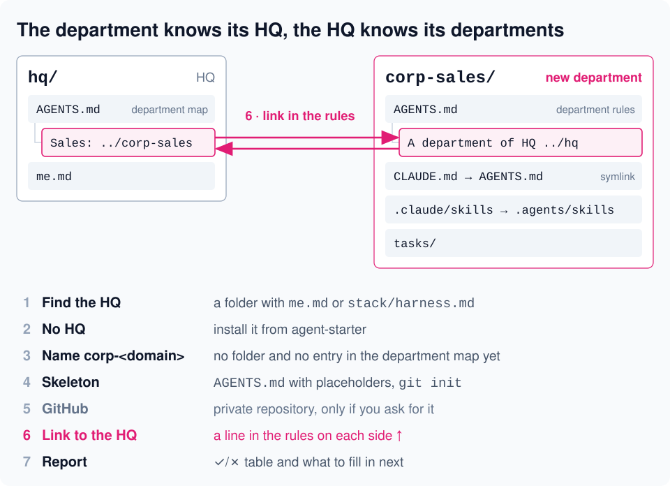

# corp-new



Creates a new department of your HQ: a folder with a rules file and a skills folder and a two-way link with the HQ in the rules; a private GitHub repository only if you ask for it. If there is no HQ yet, it first installs one from [agent-starter](https://github.com/serejaris/agent-starter) and uses its `hq` skill.

```
/corp-new
```

Or ask: "create a department", "new department", "add a department for sales".

- Finds the HQ folder (the one with `me.md` or `stack/harness.md`); installs it from agent-starter if missing.
- Picks a `corp-<domain>` name and checks that the folder and the map entry do not already exist.
- Sets up the skeleton: `AGENTS.md` with empty places for you to fill, `CLAUDE.md` and `.claude/skills` symlinks, `git init`.
- Links the HQ and the department in each other's rules; creates a private repository through `gh` only if you ask.
- Reports a table of steps with ✓/✗ and what to fill in next.

It does not write department rules for you and does not touch other files. The skill text is in Russian.

Русская версия: [README.ru.md](README.ru.md)
