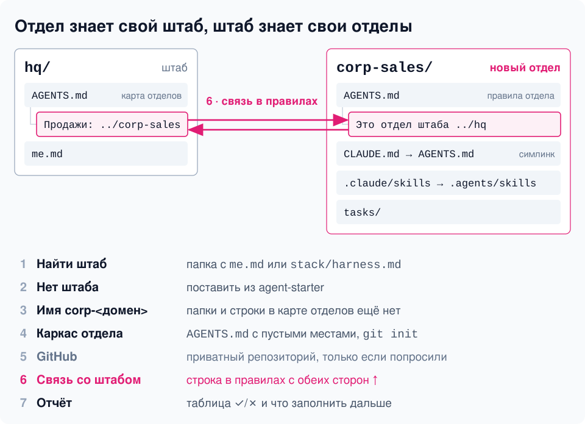

# corp-new

[](README.md)
[](README.ru.md)

Заводи отдел, когда работа в одном направлении повторяется и ты каждый раз объясняешь агенту одни и те же правила. `corp-new` создаст каркас и свяжет его со штабом: из штаба агент видит карту всей системы, из отдела читает правила твоего направления.



Создаёт новый отдел штаба: папку с файлом правил и папкой скиллов и связь со штабом в правилах в обе стороны; приватный репозиторий на GitHub — только если попросите. Если штаба ещё нет, сначала ставит его из [agent-starter](https://github.com/serejaris/agent-starter) и пользуется скиллом `hq` оттуда.

```
/corp-new
```

Или словами: «создай отдел», «новый отдел», «заведи отдел продаж».

- Находит папку штаба (с `me.md` или `stack/harness.md`); нет штаба — ставит из agent-starter.
- Подбирает имя `corp-<домен>` и проверяет, что папки и записи в карте ещё нет.
- Ставит каркас: `AGENTS.md` с пустыми местами для тебя, симлинки `CLAUDE.md` и `.claude/skills`, `git init`.
- Связывает штаб и отдел в правилах друг друга; приватный репозиторий через `gh` создаёт, только если попросите.
- Отвечает таблицей шагов ✓/✗ и тем, что заполнить дальше.

Правила отдела за тебя не пишет, чужие файлы не трогает.
