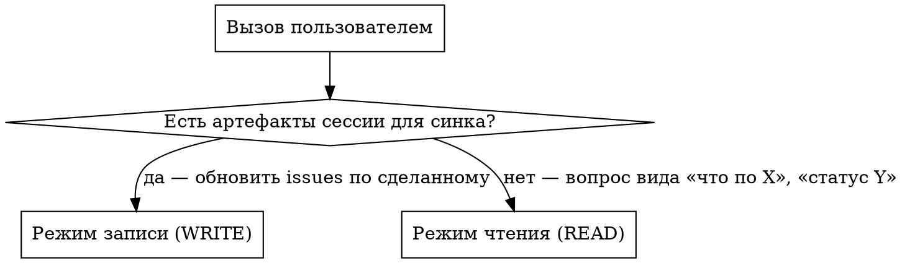

# Режимы, источники правды и pre-flight

Справочник уровня 2 (задачи в GitHub issues). Читать первым при любом вызове: как выбрать режим, что прочитать до первой команды `gh`, на каком языке отвечать.

## Оглавление

- Выбор режима
- Режим работы по умолчанию
- Язык ответа
  - Язык заголовков issue
- Источники правды (читать каждый запуск)
  - Цикл планирования и ретро
- Связанные скиллы
- Когда применять и когда нет
- Pre-flight (оба режима) — обязательное условие
  - Красный флаг: пропуск индекса задач

## Выбор режима



**Сигнал режима записи:** пользователь сказал «sync session», «зафиксируй», «обнови issues», ИЛИ вызвал `/manager` без аргументов в конце сессии, ИЛИ сам перечислил артефакты и изменения.

**Сигнал режима чтения:** пользователь спросил о состоянии — «что по», «статус», «есть ли», «какие issues по».

**Голый вызов `/manager`:** выведи артефакты из контекста текущего разговора — какие треки затронуты, какие файлы изменены или созданы, какие решения приняты. НЕ проси пользователя перечислить всё заново. Составь краткий план выполнения (5–15 строк) и выполняй по настроенному режиму авторизации.

**НЕ использовать manager для:** записи идей без артефактов (это брейншторм); закрытия issue без явной команды пользователя; массовых обновлений CRM (это CRM-скилл, не manager).

## Режим работы по умолчанию

Без шапки manager работает как `режим: оркестратор, критик · эффорт: низкий · макс: 3` (оркестратор и критик, низкий эффорт, до 3 субагентов); модель субагентов — модель текущей сессии.

Шапка `/harness` в аргументах вызова перекрывает эти значения.

Что значит каждая роль, описано в скилле `harness`. Если этот скилл не установлен, работай по этим значениям: планируй и раздавай задачи субагентам, проверяй их результаты по файлам до отчёта.

## Язык ответа

Язык ответа совпадает с языком запроса пользователя и с конвенциями проекта. Технические токены остаются как есть и не переводятся: имена issue (`<repo>#<N>`), лейблы (`W18`, `retro:W17`, `backlog`), команды (`gh issue comment`), пути к файлам, исходные английские заголовки issue в кавычках.

### Язык заголовков issue

Заголовки новых issue (и переименованных) следуют локали пользователя — совпадают с языковой конвенцией проекта. Английский допустим только как имя собственное: название продукта, репозитория, бренда, API, публичный термин апстрима (`GitHub`, `Telegram`, `LMS`, `PRD`, `E2E`). Английские глаголы действия и шаблонные фразы-заполнители в заголовках запрещены:

- ❌ `delivery track`, `launch/funnel`, `follow-up`, `workshop prep`, `handoff`, `rollout package`, `topic TBD`, `date TBD` (как английские заполнители, когда язык проекта не английский)

Все повествовательные элементы в заголовках issue, заголовках разделов тела и тексте предложения следуют локали проекта. Технические токены (`repo#N`, имена лейблов, команды CLI, пути к файлам, процитированные исходные заголовки существующих issue) остаются как есть.

## Источники правды (читать каждый запуск)

1. **`$TASKS_INDEX_PATH`** (если настроен) — индекс текущей недели. Источник для: что горит на этой неделе, какие треки активны, указатели на репозитории по каждому треку. Читать ПЕРВЫМ, чтобы задать рамку сессии.
2. **`$TASKS_DIR/WNN/YYYY-MM-DD.md`** (если настроен) — план текущего дня. Источник для: что founder реально делает сегодня. Manager может править его во время синка записи, когда затронутые issue меняют состояние.
3. **GitHub issues по всем `$YOUR_OWNER/*`** — главный источник по отдельным задачам. Поиск через `gh search issues --owner $YOUR_OWNER` или пакетный GraphQL (см. [search.md](search.md)).
4. **Доска (доски) GitHub Project** — главный источник о том, что активно на этой неделе и в какой колонке.
5. **Артефакты CRM** (если интеграция CRM включена в конфиге) — карточки встреч, возможностей, людей. НЕ замена issue на GitHub, но якорь связи: тело каждого issue, связанного с коммуникацией, обязано содержать указатель на CRM.

### Цикл планирования и ретро

Manager участвует в цикле, но не заменяет его:

- `weekly-retro` разбирает закрывающуюся неделю, решает перенос и выдаёт результаты и бэклог с доказательствами.
- `weekly-planning` ведёт `tasks.md`, `tasks/WNN/README.md` и планы дней на новую неделю.
- `manager` держит согласованными issues на GitHub, Projects, родителей, W-label, комментарии о работе и затронутые строки плана дня во время реальной работы.

Когда синк manager меняет состояние задачи, он обязан держать видимый план в соответствии с этим состоянием. Если manager закрыл issue, закрытый issue не должен остаться активной строкой P0/P1 в плане текущего дня или в индексе недели.

## Связанные скиллы

- Ведение индекса недели (когда меняется текущая неделя): скилл `weekly-planning`.
- Бэклог по итогам ретро (когда появляются лейблы `retro:W*`): скилл `weekly-retro` — эти лейблы несут исторический сигнал, не снимать.

## Когда применять и когда нет

**Применять (режим записи):**
- Пользователь говорит «sync session» / «/manager» / «обнови issues по тому что сделал»
- Конец рабочей сессии с конкретными артефактами (обновления CRM, карточки встреч, коммиты кода, документы)

**Применять (режим чтения):**
- Начало или середина сессии — пользователь спрашивает «что по <трек>», «статус», «есть ли issue по»
- Нужно состояние трека по всем репозиториям без ручного grep
- Перед решением о следующем шаге — проверить, что уже открыто

**НЕ применять:**
- Для записи новых идей без артефактов — это брейншторм
- Для закрытия issue без явной команды пользователя (см. [mistakes.md](mistakes.md))

## Pre-flight (оба режима) — обязательное условие

Pre-flight ОБЯЗАН пройти до любой команды `gh search`, `gh issue` и любой другой команды GH. Без исключений.

Pre-flight идёт молча и по минимуму. Не выводи в чат содержимое индекса задач, полный git status или каталоги лейблов. Читай нужное про себя, показывай только то, что меняет предложение. **Бюджет вывода pre-flight: 0 строк.**

1. **Прочитай `$TASKS_INDEX_PATH` ПЕРВЫМ** (если настроен). Это курируемый индекс приоритетов текущей недели + активных треков + указателей на репозитории. Без него поиск идёт вслепую (случайные ключевые слова), а не прицельно.
2. **Сними снимок недельного Project один раз за запуск** с явным большим лимитом (страница по умолчанию обрезает большие доски):
   ```bash
   gh project item-list <WEEKLY_PROJECT> --owner $YOUR_OWNER --format json --limit 1000 > /tmp/manager-proj.json
   ```
3. **Защита от Task drift.** Если в плане текущего дня или недели есть активная строка задачи без ссылки `repo#N` на issue в GitHub → покажи как `Task drift: <строка> — нет issue на GitHub`. В режиме чтения: только сообщить. В режиме записи: найди существующий issue или создай новый (после этого на него действуют железные инварианты).
4. Проверь git status релевантных репозиториев (молча). Если конкретные артефакты, упомянутые в сессии, не закоммичены, упомяни в предложении только их по имени.
5. Вычисли текущую ISO-неделю, если строка «Updated» в индексе задач устарела (>7 дней) или её нет.

**Независимые чтения `gh` запускай параллельно** — несколько вызовов Bash в одном сообщении. Последовательно — только когда вывод одного вызова нужен на вход следующему.

### Красный флаг: пропуск индекса задач

Если собираешься запустить `gh search issues`, не прочитав сначала `$TASKS_INDEX_PATH` (когда он настроен), — СТОП. Ты собираешься искать вслепую вместо того, чтобы взять уже существующий индекс Project и треков.
