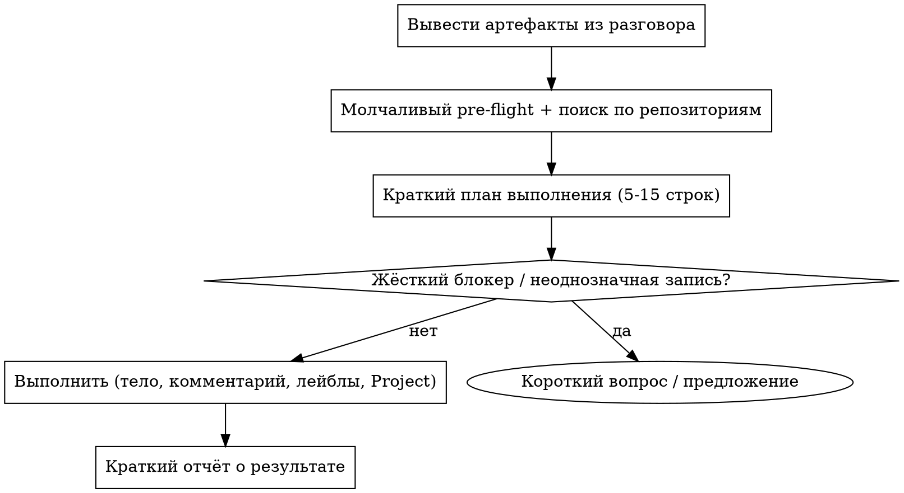

# Режим записи (синк)

Справочник уровня 2. Читать, когда выбран режим записи: алгоритм синка, авторизация, связь коммитов и issue, статус в Project, чистка плана при закрытии, выбор «обновить или создать».

## Оглавление

- Алгоритм режима записи
  - Связь коммита и issue
  - Артефакты планирования (PRD, планы, схемы)
- Синк статуса в Project (режим записи)
- Чистка плана при закрытии
- Обновить или создать
  - Комментарий — запасной канал, не основной
  - Механика обновления тела

## Алгоритм режима записи



В режиме записи для каждого затронутого issue:

1. Обнови **тело** (основной канал, не комментарий): освежи `Status` / `Next` + запись с датой в `## Updates`.
2. Добавь **комментарий о работе** (железный инвариант 6) — только если была реальная работа: что сделано в этой сессии + `refs`/SHA.
3. Обеспечь **W-label + родителя (Sub-issues API) + место в Project** и поставь колонку статуса в Project `In progress` (см. «Синк статуса в Project»).
4. Запиши **связь коммита и issue** (см. ниже).

**Режим авторизации** (из конфига в твоём `AGENTS.md` / `CLAUDE.md`):

- `ask-each-time` (по умолчанию): после плана спроси «выполнять?» до любой записи в GitHub.
- `execute-after-plan`: после молчаливого pre-flight и краткого плана выполни ограниченные записи в GitHub без отдельного подтверждения. Pre-flight всё равно пройди, существующие issues найди, инварианты сохрани и точно сообщи, что изменилось.

В обоих режимах спрашивай до записи, когда запись действительно неоднозначна или рискованна: нет подходящего родительского эпика, неясен владелец репозитория или трека, есть риск утечки приватного в публичный репозиторий, изменения разрушительные или массовые, закрывается issue с не до конца выполненным объёмом, доказательства противоречат друг другу.

### Связь коммита и issue

1. Каждый коммит в сессии должен нести трейлер: `refs $YOUR_OWNER/<repo>#N` (или `closes $YOUR_OWNER/<repo>#N`, если коммит полностью закрывает объём). GitHub показывает обратную ссылку в таймлайне issue — работает между репозиториями.
2. Запись с датой в `## Updates` перечисляет короткие SHA коммитов из каждого затронутого репозитория за сессию: `(code: <repo-A>@9a8ff92, <repo-B>@6fb5b26)`. Issue без SHA при наличии коммитов = неполный синк.
3. Собирай SHA через `git log --oneline -10` по каждому затронутому репозиторию до записи в Updates.
4. **Артефакт должен быть закоммичен и запушен ДО того, как на него сослались.** Пользователь читает всё через веб-GitHub — незакоммиченного локального файла для него не существует. Ссылки в теле и отчёте — кликабельные URL на GitHub, не локальные пути `~/...`.

### Артефакты планирования (PRD, планы, схемы)

Когда сессия выдаёт PRD, план или схему: полное содержимое идёт в **тело issue** — контекст, таблица решений, диаграммы mermaid (GitHub рендерит их прямо в issue), схема данных, MVP-срезы, что вне объёма, открытые вопросы — а не ссылка на файл. Локальный md-файл может существовать как рабочая копия; если они разошлись, источник правды — тело issue. Любая ссылка на файл из тела — кликабельный URL на GitHub, указывающий на уже закоммиченную и запушенную версию, никогда не локальный путь.

## Синк статуса в Project (режим записи)

Новые issue начинают в настроенной колонке бэклога. Первое предложение, черновик, спецификация или решение считаются работой: сохрани содержательный черновик в теле issue и перенеси его в настроенную активную колонку.

В режиме записи, когда пользователь активно работал над issue в текущей сессии, manager **обязан** поставить колонку статуса Project `In progress` всем основным и дочерним issue, затронутым:

- в глобальном недельном Project;
- на доменной доске Project трека, если issue уже там лежит.

**Правила:**
1. Обновляй только issue, которые manager обновил или создал в этом синке, плюс их видимого родителя, если родитель тоже есть в плане текущего дня.
2. Не ставь `In progress` историческим и бэклог-issue без работы в этой сессии.
3. Не понижай `Done` или `In review` без явного сигнала пользователя.
4. Если элемента ещё нет в Project — сначала `gh project item-add`, потом `gh project item-edit`, чтобы поставить статус.
5. Если родительский или сессионный issue дочернего есть в плане дня, а дочерний сегодня активен, — родителя тоже переведи в `In progress`.

```bash
# Шаг 1 — получить id элемента (из вывода item-add или снимка item-list)
# Шаг 2 — получить id поля и опции (закешируй их в конфиге)
gh project field-list <PROJECT_NUMBER> --owner $YOUR_OWNER --format json
# Шаг 3 — поставить колонку статуса
gh project item-edit \
  --id <PROJECT_ITEM_ID> \
  --project-id <project-id> \
  --field-id <status-field-id> \
  --single-select-option-id <in-progress-option-id>
```

Для каждой доменной доски сначала прочитай список полей — имена колонок могут отличаться (`In progress` vs `In Progress` vs `Active`).

**Правила Project drift:**
- Issue в Project с пустым полем Status → покажи как `Project drift: status lane empty`.
- Если ошибка GraphQL или лимита запросов блокирует правку статуса → сообщи `Project drift: placement ok, status lane pending` и не заявляй полный ремонт.

## Чистка плана при закрытии

Когда manager закрывает issue в режиме записи, в том же синке он обязан убрать этот issue с активных поверхностей планирования:

1. Прочитай `$TASKS_INDEX_PATH`, README текущей недели и файл сегодняшнего дня, если они настроены.
2. Если закрытый issue стоит активной строкой P0/P1, убери строку или замени её на следующий открытый дочерний issue под тем же родителем.
3. Если закрытый issue есть в списке issue недели или индекса, убери его, когда по этому объёму не осталось открытой работы. Если родитель остаётся активным, оставь родителя и открытые дочерние.
4. Не удаляй исторические доказательства ретро и результатов. Дописывай заметку, только если в файле плана есть текущий раздел «Done / Closed today»; иначе держи активный план чистым.
5. В отчёте о результате покажи чистку явно: `removed closed issue from day plan: repo#N`.

Если manager не закрывал issue сам, режим чтения сообщает только о дрейфе. Не чисти планы для закрытого issue, если текущий синк явно не занимается закрытием или пользователь не просил чистку.

## Обновить или создать

**По умолчанию: обновить тело issue, НЕ добавлять комментарий.** Тело = единый источник правды, читается как один документ. Комментарии складываются по хронологии и после 5+ записей становятся нечитаемыми.

| Ситуация | Действие |
|----------|----------|
| Существующий issue покрывает тот же объём, тот же трек | **Правь тело** — освежи «Status:», «Next:» и строку с датой в `## Updates`. Проверь, что W-label актуален, родительский эпик привязан И место в Project есть. |
| Объём существующего issue уже, но сессия расширила объём | Правь тело существующего + создай новый issue-продолжение с расширенным объёмом, дочерний того же эпика. |
| Несколько существующих issue совпадают по разным аспектам (родительский эпик + sub-issue) | Правь тело самого конкретного дочернего; эпик трогай, только если его тело нужно обновить. |
| Подходящего issue нет, но трек есть в индексе задач | Создай новый issue. Сначала определи родительский эпик. W-label текущий, место в Project задано. |
| Issue нет, трека в индексе задач нет, артефакт свежий | Спроси пользователя, какой репозиторий и какой эпик, до создания |
| Существующий issue покрывает 2+ соседних объёма или относится к прогнозу / воронке / операционному обзору | Считай агрегирующим issue. Сначала найди агрегирующий эпик в этом репозитории; если его нет, предложи зонтик или разделение. |
| У существующего дочернего есть ссылка на родителя в API, но в Project view он виден плоско | Не переподчиняй первым делом. Проверь место родителя в Project + колонку статуса; почини элемент родителя в Project до изменения иерархии. |
| Найден связанный issue с тем же предметом, но другим объёмом | Держи только как контекст `Related`. Обнови или создай отдельный основной issue для нового самостоятельного действия. |

### Комментарий — запасной канал, не основной

Используй комментарий ТОЛЬКО когда:

- **Запись о работе после реальной работы над issue в сессии** — один обязательный комментарий в таймлайн на пару (сессия × issue): что сделано + `refs`/SHA. Это единственный случай, когда комментарий нужен *в дополнение* к обновлению тела (железный инвариант 6). Один такой комментарий на сессию на issue; не нагромождать — сводить в тело.
- Заметка действительно хронологическая и временная (например, «заблокировано внешней стороной до <дата>») — она бы загромоздила тело.
- Пользователь явно попросил комментарий.

**Сигнал антипаттерна:** если собираешься написать третий комментарий о прогрессе в issue — это на два больше, чем нужно. Правь тело.

### Механика обновления тела

Manager владеет схемой «прочитать — изменить — записать»: `gh issue view` → локальный файл тела → `gh issue edit --body-file`, с обновлёнными `Status` / `Next` / `## Updates`. Используй стандартный `gh` CLI напрямую.
